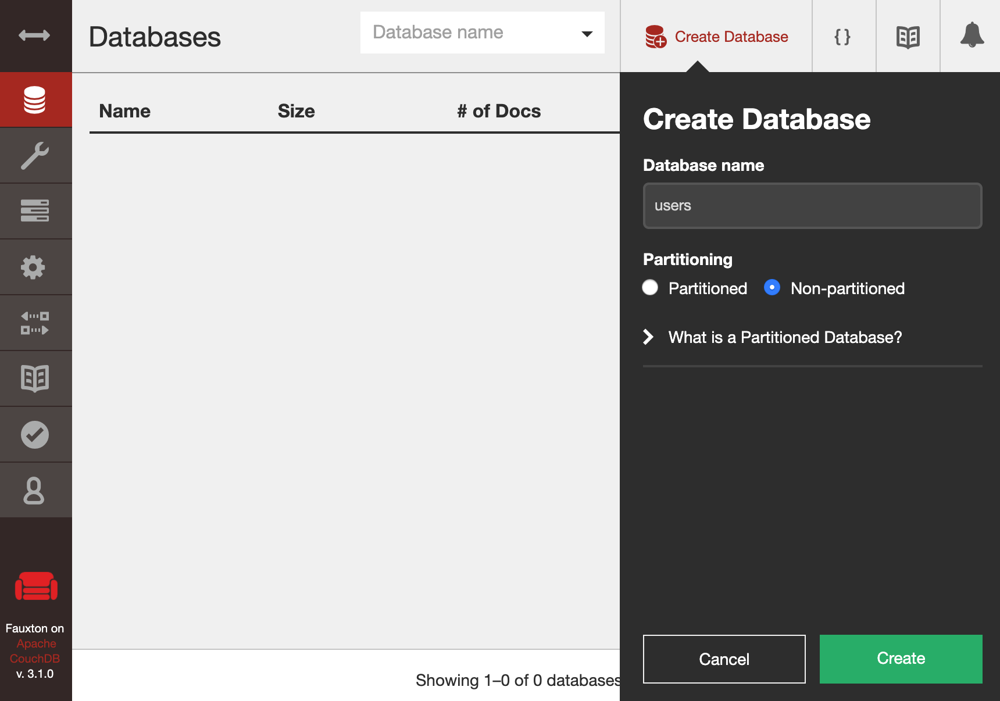
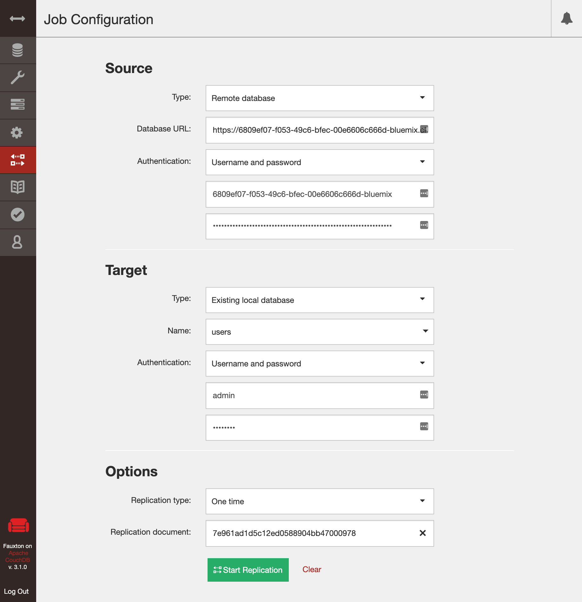

# Hands On Workshop: Introduction to Apache CouchDB

## Presentation
[Apache CouchDB / Cloudant Slides](https://slides.com/upkar/apache-couchdb-cloudant)

## Prerequisites
1. [IBM Cloud Sign up](https://ibm.biz/BdqfxE): Use this link to sign into your account if you already have one : <https://ibm.biz/BdqfxE>
2. [Postman to finish workshop](https://www.getpostman.com/downloads/)
3. I also really like [Insomia](https://insomnia.rest/download/)
4. Load [existing workspace](data/couchdb.postman_collection.json) into postman or insomnia and change environment variables. 
5. Create database and load [person.json](data/person.json) into the database. You should get 1000 person records. I used [Mockaroo](https://mockaroo.com/) to generate this random data.

## Optional
1. Run couchdb locally
   1. `docker pull couchdb`
   2. `docker run -d --name my-couchdb -e COUCHDB_USER=admin -e COUCHDB_PASSWORD=password -p 5984:5984 couchdb`
   3. docker ps
        ```
        CONTAINER ID        IMAGE               COMMAND                  CREATED             STATUS              PORTS                                        NAMES
        35c8c7264fa9        couchdb             "tini -- /docker-ent…"   6 seconds ago       Up 6 seconds        4369/tcp, 9100/tcp, 0.0.0.0:5984->5984/tcp   my-couchdb
        ```
2. Visit Futon `localhost:5984/_utils/`
3. Create `users` database locally
   
    

4. Configure replication
   
    

    Don't forget to add database name to the end of the URL.
    ```
    {
        "source" : "https://$USERNAME1:$PASSWORD1.example.com/db",
        "target" : "https://$USERNAME2:$PASSWORD2@$ACCOUNT2.cloudant.com/db",
    }
    ```

## Event Description
RSVP on Crowdcast NOW:

❗Please do not forget to register on Crowdcast and join us using Chrome browser via Crowdcast on the event date!

❗In order to take full advantage of this workshop, please do not forget to sign up for a FREE IBM Cloud account prior to the workshop by using the link below.
https://ibm.biz/BdqfxE

Join IBM Developer SF to get an introduction to Apache CouchDB - an open-source document-oriented database software that focuses on ease of use and having a scalable architecture.

A database in CouchDB is not a group of tables, but a collection of documents (JSON objects). We will use Cloudant, a hosted version on IBM Cloud, for the demo to avoid spending time installing locally.

We will look at how to create a simple CRUD application in CouchDB and then explore more advance features including:
1. Design Documents to transform, update and validate documents
2. Views to query documents using MapReduce
3. Mango Query Server to write JSON queries
4. HTTP API that makes CouchDB ideal for the web

## Speaker: Upkar Lidder
Upkar Lidder is a Full Stack Developer and Data Wrangler with a decade of development experience in a variety of roles. He can be seen speaking at various conferences and participating in local tech groups and meetups. He is currently curious about the magic behind Machine Learning and Deep Learning, specifically use of NLP in chatbots. Upkar went to graduate school in Canada and currently resides in the United States.

